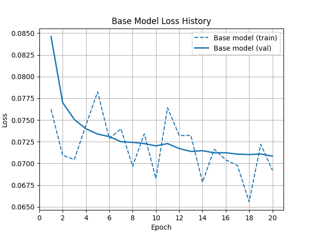
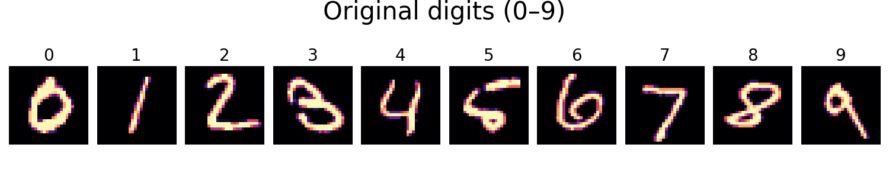
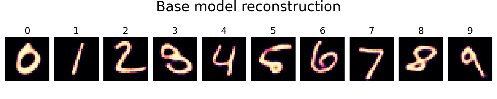
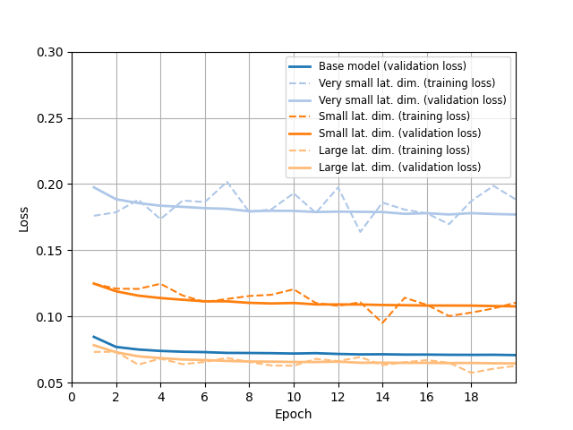
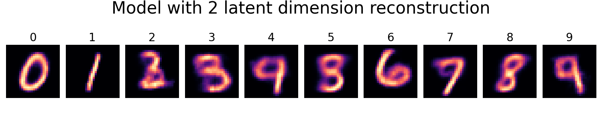
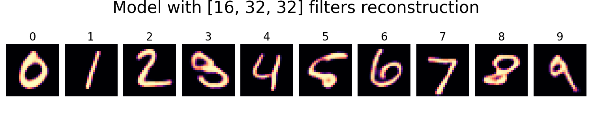

# Convolutional Autoencoder (CAE) for MNIST digits

This project explores the development and architectural optimization of a convolutional autoencoder (CAE) for the MNIST handwritten digits dataset. Instead of relying on grid search, the study isolates and evaluates individual architectural hyperparameters through a series of experiments in order to gain practical insights into how they affect key aspects of autoencoder performance: latent space compactness, reconstruction quality, and computational efficiency. 

The study begins by defining and training a baseline CAE model, which serves as a reference point for all subsequent experiments. Each of the five experiments varies one factor at a time — the number of convolutional filters, the size of the latent space, the use of batch normalization, the choice of activation function (ReLU vs. Leaky ReLU), and the depth of the encoder-decoder architecture — to assess its influence on training dynamics, reconstruction quality, and overall model complexity.

The insights gained from these isolated experiments are ultimately used to propose a balanced model configuration that offers an effective trade-off between accuracy and resource usage, within the scope of MNIST digit reconstruction.

---

## 📉 ~Objective~

~To evaluate the impact of individual architectural components on a CAE's ability to compress and reconstruct grayscale handwritten digits. Each experiment isolates a single hyperparameter to assess its effect independently.~

---

## 🧱 Baseline CAE Model
This model is a minimal Convolutional Autoencoder (CAE), trained on the MNIST digits dataset, and serving as the foundational benchmark for all experiments in this project. This model strikes a solid balance between simplicity and accuracy, making it an ideal reference point for evaluating architectural changes in all subsequent experiments.

Detailed overview is in the baseline model available by the link: [Convolutional Autoencoder (CAE) — Baseline Model](notebooks/CAE_base_model.ipynb)

### ⚙️ Model Overview
-	Encoder/decoder channels: [32, 32, 64]
-	Latent dimension size: 32
-	Batch normalization: not used
-	Convolutional depth: 3 layers
-	Activation: ReLU

### 🏋️‍♂️ Training
-	The model was trained for 20 epochs using the Adam optimizer (`lr = 1e-3`) with a `ReduceLROnPlateau` scheduler.  
-	Both training and validation losses steadily decreased and stabilized within 10 epochs, indicating smooth convergence without overfitting.
-	The same training setup (epochs, optimizer, scheduler) was applied across all experiment models for consistent comparison.

  

### 🖼️ Reconstruction Results
- The baseline CAE reliably reconstructs handwritten digits with high visual fidelity and no visible artifacts.  
- Key digit features are preserved across all samples, making this model a strong reference point for evaluating reconstruction quality in later experiments.

  

  

## 🔍 Experiments Overview

The table below present summary of each experiment - the number of experiment; what hyperparameter change was studied; what variants of the hyperparameter were; and a link to notebooks, describing the experiments setups and results in detail.

| Experiment # | Hyperparameter         | Variants                                  | Notebook Link |
|--------------|-------------------------|-------------------------------------------|----------------|
| 1            | Number of convolutional filters       | `[16,32,32]`, `[32,32,64]`, `[32,64,128]`               | [Experiment #1 - Different Number of Filters](notebooks/CAE_experiment_1(filters).ipynb) |
| 2            | Latent space dimension        | `2`, `8`, `32`, `64`                      | [Experiment #2 - Different Laten Space Sizes](notebooks/CAE_experiment_2(latent_dim).ipynb) |
| 3            | Batch normalization     | Off vs On                                 | [Experiment #3 - Usage of Batch Normalization](notebooks/CAE_experiment_3(batch_norm).ipynb) |
| 4            | Number of convolutional layers     | `2 layers`, `3 layers`, `4 layers`           | [Experiment #4 - Different Convolutional Depths](notebooks/CAE_experiment_4(conv_depth).ipynb) |
| 5            | Activation function type| `ReLU` vs 'Leaky ReLU' with `0.01`, '0.1', '0.2' slopes                         | [Experiment #5 - Usage of Leaky ReLU](notebooks/CAE_experiment_5(leaky_relu).ipynb) |

## Key Insights from Experiments
### 1. Latent dimension is the primary driver of reconstruction quality:
- Among all tested architectural parameters, **latent space dimensionality** had the most significant impact on both training loss and visual reconstruction quality

  
  
<em>Validation loss across different latent dimensions (2, 8, 32, 64)</em>

- **Smaller latent sizes** (e.g., 2 or 8) led to blurry or ambiguous digit reconstructions  

  
  
<em>Reconstruction with latent_dim = 2 — degraded clarity and digit confusion</em>

- **Larger latent sizes** (32 and 64) improved accuracy, but with diminishing improvements beyond 32  

  
  
<em>Reconstruction with latent_dim = 32 and 64 — near-identical quality</em>

### 2. ⚙️ Filter Width Has Minor Effect on reconstruction quality and loss
- Increasing the number of convolutional filters led to **slightly lower reconstruction loss** and **marginal improvement of reconstruction quality**.
- All configurations of convolution filters successfully preserved the structure of the digits with **indistinguishable to the naked eye** visual differences between them

  
  
<em>Reconstructions from models with different filter configurations: 
  [16,32,32] (narrow) vs [32,32,64] (baseline) vs [32,64,128] (wide)</em>

 
### 3. 🔬 Other Factors (Depth, Activation, BatchNorm) are negligible 
- Increasing **convolutional depth** beyond two layers **did not improve reconstruction quality**. Although, while training dynamics varied early on, all three models eventually converged to similar loss level in the end

  
  
<em>Loss curves for CAE models with 2 vs 3 encoding/decoding blocks — same final performance</em>

- Switching from ** ReLU to Leaky ReLU** had no measurable effect on output quality
- Enabling **batch normalization** led to slightly smoother training, but final results remained unchanged

### 4. 📦 Model Complexity is only driven by Filters and Depth

- **Filter width** and **convolutional depth** have the greatest impact on parameter count  
- **Latent dimension** influences model size but in a relatively minor manner
- **Batch Normalization** adds some overhead
- **Activation function** has no impact on complexity
(bar plot)

  
  
<em>Parameter count across model variants</em>

### 5. 🎯 Latent Space is the hidden lever behind autoencoder efficiency

Among all explored parameters, **latent dimensionality stands out as the only one directly tied to every key objective**:
- It governs **reconstruction quality** - too small leads to poor digit retention  
- It shapes **model compactness** - larger spaces absolutely defeat the purpose of encoding  
- It influences **model size ** - smaller latent space results in fewer parameters count

> 🧠 **Unlike filters or depth**, which mainly affect model size, the latent space defines the *informational bottleneck* — the core idea behind autoencoding.

> 💡 **Conclusion:** Optimizing the latent space is not just about accuracy, but about aligning the model with its true purpose — learning **the minimal shape of encoding that can be decoded with the most meaningful reconstruction quality**.

## 💡 Key Conclusions from the Experiment

1. Increasing latent space dimensionality enhances reconstruction quality but contradicts the compactness objective. A tradeoff latent dimensions should be applied.
2. Wider filters slightly reduce loss but offer no substantial visual improvement, making their added cost **unjustified for a simple dataset like MNIST**.
3. Such architectural modifications as usage of batch normalization, leaky ReLU activation function, and additional convolution layers  add complexity without any performance gains.
4. Decreasing filter size and number of convlutional layers must be prioritized to reduce computational footprint.
5. 

## ⚖️ Considerations for the Trade-Off Model
Given that the goal of the trade-off model is to achieve an optimal balance between reconstruction quality, model compactness, and computational efficiency - especially for lightweight tasks like MNIST digit encoding.

The following design decisions are grounded in experimental evidence:
### **🔐 Latent dimension is set to 16**  
  While latent size strongly affects output quality, it must remain small to serve the encoder’s purpose. A dimension of 16 offers a practical compromise between compression and clarity.

###**🧱 Depth is reduced to 2 encoding/decoding blocks**  
  Experimental results confirm that additional layers do not improve final loss or visual output, yet substantially increase parameter count.
- **🔽 Filters are narrowed to `[32, 32]`**  
  This reduces overall complexity while still preserving enough feature extraction capacity to support faithful reconstructions.

-**❌ Batch Normalization & Leaky ReLU are omitted**  
These components showed negligible effect on reconstruction quality and training dynamics, so they are excluded to simplify the architecture.

> 🧠 Together, these changes result in a lean, performant model — suitable for efficient deployment without significant sacrifice in quality.

## ⚖️ Baseline vs Trade-Off Model

The trade-off model was designed to balance reconstruction quality with resource efficiency. While the baseline CAE offers slightly better loss performance, it is more complex than necessary for a dataset as simple as MNIST. The trade-off model achieves comparably strong reconstructions with significantly lower parameter count and a smaller latent space, making it ideal for lightweight deployment.

### 🧮 Architecture Comparison

| Property         | Baseline CAE     | Trade-Off CAE  |
|------------------|------------------|----------------|
| Filters          | [32, 32, 64]     | [32, 32]       |
| Latent Dimension | 32               | 16             |
| Depth            | 3 blocks         | 2 blocks       |
| Total Parameters | ~1.2M            | ~0.7M          |

> 💡 The trade-off model has **~40% fewer parameters**, reduces depth, and encodes into a **more compact latent space** — all while maintaining acceptable reconstruction quality.

---

### 🖼️ Visual Comparison

Despite its lighter architecture, the trade-off model retains sufficient decoding capacity to reconstruct digits clearly and accurately.

  
  
  
<em>Baseline (left) vs Trade-Off (right) — Sample Reconstructions</em>

---

### ✅ Conclusion

The trade-off CAE offers the best balance across all evaluation criteria:
- Compact latent encoding  
- Competitive reconstruction quality  
- Significantly reduced model complexity  
