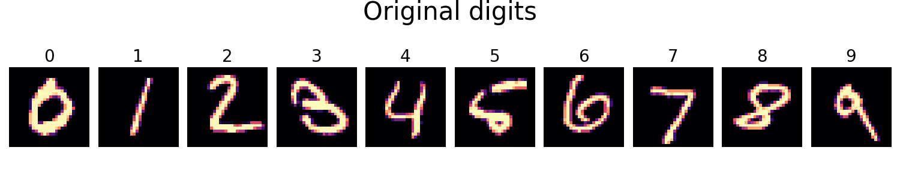
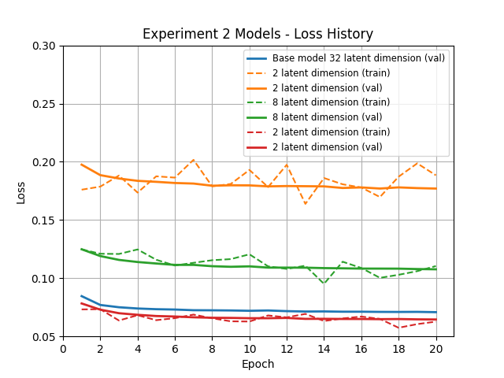
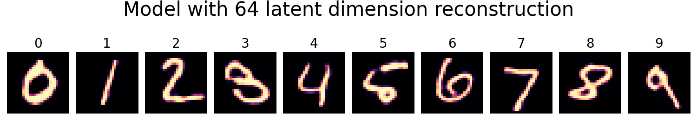
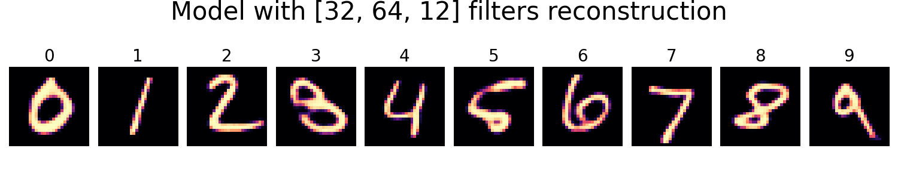
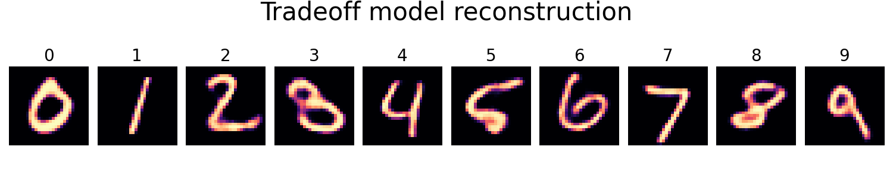

# Convolutional Autoencoder (CAE) for MNIST digits

[](https://www.python.org/)
[](https://pytorch.org/)
[](https://colab.research.google.com/)
[](http://yann.lecun.com/exdb/mnist/)
[]()
[]()
[](https://github.com/vlad-uve/CAE-MNIST)


### 🧠 Summary

This project explores the **development and architectural optimization** of a **Convolutional Autoencoder (CAE)** for the MNIST handwritten digits dataset. Instead of relying on grid search, the study isolates and **evaluates individual architectural hyperparameters** through a series of experiments in order to gain practical insights into how they **affect key aspects of autoencoder performance**.

The key aspects of autoencoder performance:

- 🔐 **Latent space compactness**  
- 🎨 **Reconstruction quality**  
- ⚙️ **Computational efficiency**


### 🧱 Experimental Design

The study begins by defining and training a **baseline CAE model**, which serves as a reference point for all subsequent experiments. Each of the five experiments varies **one factor at a time** to assess its influence on **training dynamics**, **output fidelity**, and **model complexity**.

Five architectural factors are tested independently:

- **1. 🧩 Number of convolutional filters**
- **2. 🔽 Latent space size**
- **3. 📏 Use of batch normalization**
- **4. ⚡ Activation function** (ReLU vs. Leaky ReLU)
- **5. 🧱 Encoder-decoder depth**


### 🎯 Objective 1 — Experimental Insights and Trade-Off Model

 - To **evaluate the impact of individual architectural components** on a CAE's ability to compress and reconstruct MNIST digits, and on a model's size.

- to propose **trade-off model** configuration that offers an effective trade-off between **accuracy** and **resource usage**, within the scope of MNIST digit reconstruction task.

### 🔥 Objective 2 — PyTorch Exploration

In parallel, this project served as **practical exploration of PyTorch**, focused on building a **modular, expensible CAE architecture** from scratch.

This includes:
- 🧰 Designing a **template-based model structure** that supports plug-and-play architecture changes
- 🔄 Implementing clean, reusable **training and evaluation pipelines**
- 📦 Managing and varying **architectural complexity through configuration**
- ⚙️ Discovering fluency in PyTorch’s **class-based model design and training loop customization**

---

## 1. 🧱  Baseline CAE Model
This model is a minimal Convolutional Autoencoder (CAE), trained on the MNIST digits dataset, and serving as the foundational benchmark for all experiments in this project. This model strikes a **solid balance** between **simplicity** and **accuracy**, making it an ideal **reference point** for evaluating architectural changes in all subsequent experiments.

**Detailed overview of the baseline model is available by the link:** [👉 Convolutional Autoencoder (CAE) — Baseline Model](notebooks/CAE_base_model.ipynb)

### 1.1. ⚙️ Model architecture overview
-	Encoder/decoder channels: [32, 32, 64]
-	Latent dimension size: 32
-	Batch normalization: not used
-	Convolutional depth: 3 layers
-	Activation: ReLU

### 1.2. 🏋️‍♂️ Training
-	The model was trained for 20 epochs using the Adam optimizer (`lr = 1e-3`) with a `ReduceLROnPlateau` scheduler.  
-	Both training and validation losses steadily decreased and stabilized within 10 epochs, indicating smooth convergence without overfitting.
-	The same training setup (epochs, optimizer, scheduler) was applied across all experiment models for consistent comparison:

<div align="center">
  
  <p><em>Reconstruction loss history of baseline model</em></p>
</div>

### 1.3. 🖼️ Reconstruction results
- The baseline CAE reliably reconstructs handwritten digits with high visual fidelity and no visible artifacts.  
- Key digit features are preserved across all samples, making this model a strong reference point for evaluating reconstruction quality in later experiments:
  
<div align="center">
  
</div>
<div align="center">
  
  <p><em>Comparison of original digits (upper image) with reconstructed (lower image)</em></p>
</div>

## 2. 🔍 Experiments Overview

The table below present summary of each experiment - the number of experiment; what hyperparameter change was studied; what variants of the hyperparameter were; and a link to notebooks, describing the experiments setups and results in detail.

| Experiment # | Hyperparameter         | Variants                                  | Notebook Link |
|--------------|-------------------------|-------------------------------------------|----------------|
| 1            | Number of convolutional filters       | `[16,32,32]`, `[32,32,64]`, `[32,64,128]`               | [👉 Experiment #1 - Different Number of Filters](notebooks/CAE_experiment_1(filters).ipynb) |
| 2            | Latent space dimension        | `2`, `8`, `32`, `64`                      | [👉 Experiment #2 - Different Latent Space Sizes](notebooks/CAE_experiment_2(latent_dim).ipynb) |
| 3            | Batch normalization     | Off vs On                                 | [👉 Experiment #3 - Usage of Batch Normalization](notebooks/CAE_experiment_3(batch_norm).ipynb) |
| 4            | Number of convolutional layers     | `2 layers`, `3 layers`, `4 layers`           | [👉 Experiment #4 - Different Convolutional Depths](notebooks/CAE_experiment_4(conv_depth).ipynb) |
| 5            | Activation function type| `ReLU` vs 'Leaky ReLU' with `0.01`, '0.1', '0.2' slopes                         | [👉 Experiment #5 - Usage of Leaky ReLU](notebooks/CAE_experiment_5(leaky_relu).ipynb) |

## 3. 👁️ Key Insights from Experiments
### Insight 1 - 🧠 Latent dimension is the primary driver of reconstruction quality:
- Among all tested architectural parameters, **latent space dimensionality** had the most significant impact on both training loss and visual reconstruction quality:
  
<div align="center">
  
  <p><em>Reconstruction loss across different latent dimensions (2, 8, 32, 64)</em></p>
</div>

- **Smaller latent sizes** (e.g., 2 or 8) led to blurry or ambiguous digit reconstructions:
  
<div align="center">
  
</div>
<div align="center">
  
  <p><em>Reconstruction with latent dimension 2 (upper image) and with latent dimension 8 (lower image) </em></p>
</div>

- **Larger latent sizes** (32 and 64) improved accuracy, but with diminishing improvements beyond 32:
  
<div align="center">
  
</div>
<div align="center">
  
  <p><em>Reconstruction with latent dimension 32 (upper image) and latent dimension 64 (lower image)</em></p>
</div>

### Insight 2 - ⚙️ Number of convolutional filters has minor effect on reconstruction quality and loss
- Increasing the number of convolutional filters led to **slightly lower reconstruction loss** and **marginal improvement of reconstruction quality**.
- All configurations of convolution filters successfully preserved the structure of the digits with **indistinguishable to the naked eye** visual differences between them:
  
<div align="center">
  
</div>
<div align="center">
  
</div>
<div align="center">
  
  <p><em>Reconstructions from models with different filter configurations</em></p>
</div>
 
### Insight 3 - 🧩 Other factors — depth of convolutional layers; activation functions; usage of batch normalization — are negligible 
- Increasing **convolutional depth** beyond two layers **did not improve reconstruction quality**. Although, while training dynamics varied early on, all three models eventually converged to similar loss level in the end:

<div align="center">
  
  <p><em>Loss curves for CAE models with 2, 3 and 4 encoding/decoding blocks — same final performance</em></p>
</div>
- Switching from ** ReLU to Leaky ReLU** had no measurable effect on output quality
- Enabling **batch normalization** led to slightly smoother training, but final results remained unchanged

### Insight 4 - 📦 Model Complexity is only driven by latent space, filters and depth

- **Latent dimension**, **filter width** and **convolutional depth** have the greatest impact on parameter count:
  
<div align="center">
  
  <p><em>Parameter count across model variants</em></p>
</div>

- **Batch Normalization** has no impact on complexity
- **Activation Function** has no impact on complexity


### Insight 5 - 🎯 Latent Space is the hidden lever behind autoencoder performance

Among all explored parameters, **latent dimensionality stands out as the only one directly tied to every key objective**:
- It governs **reconstruction quality** - too small leads to poor digit retention.  
- It shapes **model compactness** - larger spaces absolutely defeat the purpose of encoding.  
- It influences **model size** - smaller latent space results in fewer parameters count.

## 4. 💡 Key Conclusions from the Experiment

1. Increasing latent space dimensionality **enhances reconstruction quality** but **contradicts the compactness objective**. A tradeoff latent dimensions should be applied.
2. Wider filters slightly reduce loss but offer no substantial visual improvement, making their added cost **unjustified for a simple dataset like MNIST**.
3. Such architectural modifications as usage of batch normalization, leaky ReLU activation function, and additional convolution layers  **add complexity without any noticeable performance gains**.
4. Decreasing filter size, latent space and number of convlutional layers **must be prioritized** to reduce computational footprint.

## 5. ⚖️ Considerations for the Trade-Off Model
Given that the goal of the trade-off model is to achieve an optimal balance between reconstruction quality, model compactness, and computational efficiency (especially for lightweight tasks like MNIST digit encoding).

**Detailed overview of the trade-off model is available by the link:** [👉 Convolutional Autoencoder (CAE) — Trade-Off Model](notebooks/CAE_tradeoff_model.ipynb)

### The following design decisions are grounded in experimental evidence:

### 1. 🔐 Latent dimension is set to 16:  
While latent size strongly affects output quality, it must remain small to serve the encoder’s purpose. A dimension of 16 offers a practical compromise between compression and clarity.

### 2. 🧱 Depth is reduced to 2 encoding/decoding blocks:  
Experimental results confirm that additional layers do not improve final loss or visual output, yet substantially increase parameter count.

### 3. 🔽 Filters are narrowed to [32, 32]  
This reduces overall complexity while still preserving enough feature extraction capacity to support faithful reconstructions.

### 4. ❌ Batch Normalization & Leaky ReLU are omitted  
These components showed negligible effect on reconstruction quality and training dynamics, so they are excluded to simplify the architecture.

>**🧠 Together, these changes result in a lean, performant model - suitable for efficient deployment without significant sacrifice in quality**

## 6. ⚖️ Baseline vs Trade-Off Model

The trade-off model was designed to **balance reconstruction quality with resource efficiency**. While the baseline CAE offers slightly better loss performance, it is more complex than necessary for a dataset as simple as MNIST. The trade-off model achieves comparably **strong reconstructions** with significantly **lower parameter count** and a **smaller latent space**, making it **ideal for lightweight deployment**.

### 6.1. 🧮 Architecture Comparison

| Property         | Baseline CAE     | Trade-Off CAE  |
|------------------|------------------|----------------|
| Filters          | [32, 32, 64]     | [32, 32]       |
| Latent Dimension | 32               | 16             |
| Depth            | 3 blocks         | 2 blocks       |
| Total Parameters | ~137K            | ~86K          |

> 💡 The trade-off model has **~40% fewer parameters**, reduces depth, and encodes into a **more compact latent space** — all while maintaining acceptable reconstruction quality.~


### 6.2. 🖼️ Visual Comparison

Despite its lighter architecture, the trade-off model retains sufficient decoding capacity to reconstruct digits clearly and accurately.

<div align="center">
  
</div>
<div align="center">
  
  <p><em>Baseline (upper image) vs Trade-Off (lower image) — Sample Reconstructions</em></p>
</div>


## 7. ✅ Conclusion

The trade-off CAE architecture offers the most effective balance across all key criteria:
- **🔐 Compact and efficient latent representation**  
- **🎨 Strong reconstruction quality, comparable to heavier models**  
- **⚙️ Substantially lower model complexity and parameter count**  

>This model reflects the insights gained through a series of targeted experiments, each isolating a single architectural factor to evaluate its impact.


## 8. 🧠 Trade-Off Model Deployment

This repository includes the final **trade-off CAE model**, optimized for lightweight digit reconstruction.

### 8.1. 📦 Model Components

| Component       | Location                                                                              
| --------------- | ------------------------------------------------------- |
| 🧱 Model Architecture | `outputs/tradeoff_model_files/tradeoff_architecture.py` |
| 💾 Model Weights      | `outputs/tradeoff_model_files/tradeoff_model.pth`       |
| ⚙️ Model Hyperparameters   | Defined manually in code (see below)                    |

### 8.2 🛠️ Hyperparameters Used

```python
tradeoff_n_channels = [32, 32]
tradeoff_latent_dim = 16

tradeoff_model = TradeoffAutoEncoder(
    n_channels=tradeoff_n_channels,
    latent_dim=tradeoff_latent_dim
).to(device)
```

### 8.3 🖁️ How to Load the Model

#### 1. Import the architecture:

```python
from outputs.tradeoff_model_files.tradeoff_architecture import TradeoffAutoEncoder
```

#### 2. Instantiate and load weights:

```python
import torch

device = torch.device("cuda" if torch.cuda.is_available() else "cpu")

model = TradeoffAutoEncoder(
    n_channels=[32, 32],
    latent_dim=16
).to(device)

model.load_state_dict(torch.load("outputs/tradeoff_model_files/tradeoff_model.pth", map_location=device))
model.eval()
```

>This will load the compact model and restore its trained weights for immediate evaluation or deployment.


## 9. 📌 Final Reflection

This project provides a principled and interpretable study of how architectural decisions affect the performance of **Convolutional Autoencoders (CAEs)** in a controlled setting. By isolating individual hyperparameters rather, than relying on brute-force tuning, the experiments uncovered which elements meaningfully impact **reconstruction quality**, **efficiency**, and **model complexity**.

Through this process, a **compact and efficient trade-off model** was developed. It meets the core objective of autoencoding: creating **minimal latent representations** while retaining **high-fidelity reconstructions**. The result is a model that is significantly lighter than the baseline, yet performs comparably well on the MNIST dataset.

The methodology and insights from this project can be transferred to other datasets and tasks involving **image compression**, **representation learning**, or **generative modeling**. More importantly, it demonstrates the value of understanding the *why* behind architecture choices — a critical mindset for **building optimized and explainable deep learning systems**.

In addition to the experimental insights, the project provided a **hands-on learning experience with PyTorch 🔥** — from building models using class-based design to implementing custom training loops and structuring modular, reusable code.

---

## 📄 License

This project is licensed under the MIT License — see the [LICENSE](LICENSE) file for details.